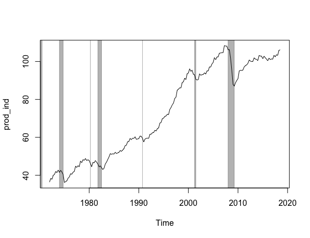
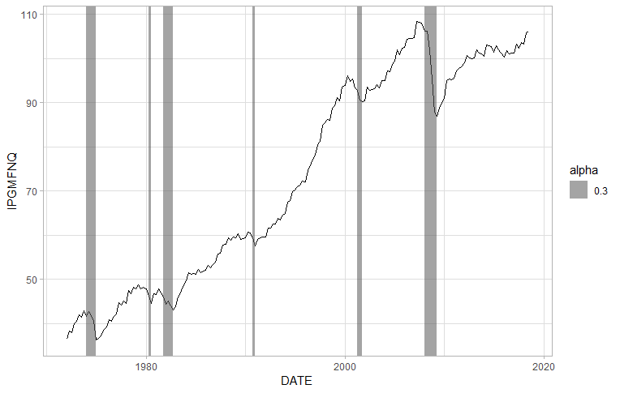

# recessionR
An R package that allows you to plot NBER recessions gray boxes, both in base plot and in ggplot2

## Installing

This is not yet aviable at CRAN, but you can install using the **devtools** package:

```
devtools::install_github(danmrc/recessionR)
```

IF you are using WIndows, you must have RTools installed (this is not a package!)

## Examples

For example, lets plot the quartely industrial manufacturing production of USA (you can get it from [FRED](https://fred.stlouisfed.org/series/IPGMFNQ)) and the command `plot_recession` allows you to see when there is a recession using the classic gray shade areas. For example, if you save the Industrial Production series as `ind_prod`, the following code:

```
plot(ind_prod)
plot_recession("q")

```

Generates the following figure:



And now the example for ggplot2. We assume you have a data frame named dat, with two columns, _DATES_ and _IPGMFNQ_ - this is exactly the names you would get downloading the .csv from FRED's website:

```
dat[,1] <- as.Date(dad[,1])

ggplot() + geom_line(data = dat,aes(DATE,IPGMFNQ)) + nber_recession_ggplot("q",start_date = dat$DATE[1],end_date = dat$DATE[187]) + theme_light()
```

And the result would be:


